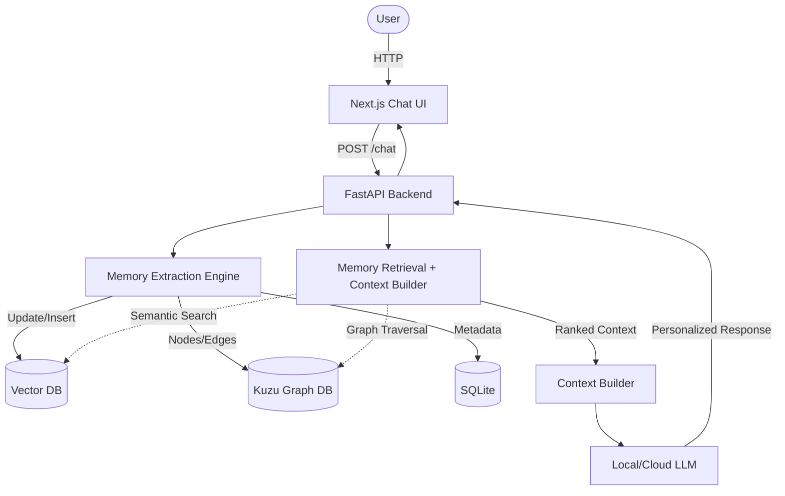

# Architecture Overview

## 1. High-Level Architecture

The architecture consists of 7 major components designed to intercept user messages, extract knowledge, and augment the LLM prompt.

## 2. Component Descriptions

1. **Frontend**: React-based UI featuring the chat interface and the Memory Dashboard.
2. **Backend API**: The central coordinator handling auth, routing, and business logic.
3. **LLM**: Generation engine (Mistral/Gemini/Local Llama). Has no native memory.
4. **Memory Extraction Engine**: Analyzes incoming messages to extract facts, decisions, goals, etc. Calculates importance and handles duplication/conflict.
5. **Vector Memory**: Stores dense embeddings of memories for fuzzy semantic retrieval.
6. **Knowledge Graph**: Stores explicit entities and relationships for logical graph traversal.
7. **Retrieval & Context Builder**: Merges results from Vector and Graph DBs, applies the ranking algorithm, and constructs the final prompt for the LLM.
