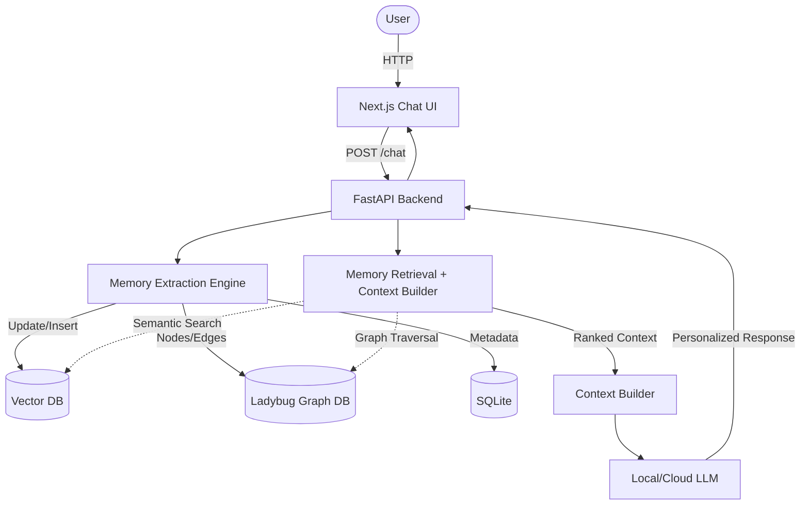
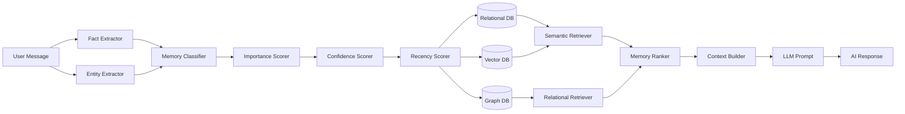

# Architecture Overview

## 1. Design Principles

This architecture follows **SOLID principles** and **Clean Code conventions** by Robert C. Martin (Uncle Bob):

| Principle | Application |
|-----------|-------------|
| **Single Responsibility** | Each component has one reason to change |
| **Open/Closed** | Interfaces allow extension without modification |
| **Liskov Substitution** | Database implementations are interchangeable |
| **Interface Segregation** | Small, focused interfaces |
| **Dependency Inversion** | High-level modules depend on abstractions |

**Example - Single Responsibility:**
```python
# BAD: Class does too many things
class MemoryProcessor:
    def extract_facts(self, message): ...
    def classify_memory(self, memory): ...
    def score_memory(self, memory): ...
    def store_memory(self, memory): ...

# GOOD: Each class has one responsibility
class FactExtractor:
    def extract(self, message): ...

class MemoryClassifier:
    def classify(self, memory): ...

class ImportanceScorer:
    def score(self, memory): ...

class MemoryRepository:
    def store(self, memory): ...
```

**Example - Open/Closed:**
```python
# Interface - Open for extension
class IExtractor(ABC):
    @abstractmethod
    async def extract(self, message: str) -> Dict: pass

# Closed for modification - existing code doesn't change
class FactExtractor(IExtractor):
    async def extract(self, message: str) -> Dict:
        pass

# Adding new extractor doesn't modify existing code
class SentimentExtractor(IExtractor):
    async def extract(self, message: str) -> Dict:
        pass
```

## 2. High-Level Architecture

The architecture consists of 7 major components designed to intercept user messages, extract knowledge, and augment the LLM prompt.



## 3. Component Descriptions

1. **Frontend**: React-based UI featuring the chat interface and the Memory Dashboard.
2. **Backend API**: The central coordinator handling auth, routing, and business logic.
3. **LLM**: Generation engine. Any OpenAI-SDK-compatible provider — Mistral is the default; OpenAI / Groq / Together / a local OpenAI-compatible endpoint all work. Has no native memory.
4. **Memory Extraction Engine**: Analyzes incoming messages to extract facts, decisions, goals, etc. Calculates importance and handles duplication/conflict.
5. **Vector Memory**: Stores dense embeddings of memories for fuzzy semantic retrieval.
6. **Knowledge Graph**: Stores explicit entities and relationships for logical graph traversal.
7. **Retrieval & Context Builder**: Merges results from Vector and Graph DBs, applies the ranking algorithm, and constructs the final prompt for the LLM.

## 4. Architecture Patterns

| Pattern | Application |
|---------|-------------|
| **Repository Pattern** | Data access abstraction |
| **Strategy Pattern** | LLM client selection |
| **Factory Pattern** | Database instantiation |
| **Pipeline Pattern** | Memory processing flow |
| **Dependency Injection** | Component wiring |

### Memory Pipeline Flow



## 5. Dependency Flow (DIP Applied)

```text
┌─────────────────────────────────────────────────────┐
│                    API Layer                         │
│              (Routes + Controllers)                  │
└─────────────────────┬───────────────────────────────┘
                      │ depends on
                      ▼
┌─────────────────────────────────────────────────────┐
│               Business Logic Layer                   │
│            (Engine: Extract, Classify, Score)        │
└─────────────────────┬───────────────────────────────┘
                      │ depends on
                      ▼
┌─────────────────────────────────────────────────────┐
│              Data Access Layer (Interfaces)          │
│         (IRelationalDB, IVectorDB, IGraphDB)        │
└─────────────────────┬───────────────────────────────┘
                      │ implements
                      ▼
┌─────────────────────────────────────────────────────┐
│              Database Implementations                │
│        (SQLite, Ladybug, future vector stores)       │
└─────────────────────────────────────────────────────┘
```

## 6. Frontend Architecture

```text
frontend/src/
├── app/           # Pages (chat, dashboard)
├── components/    # UI Components (chat, memory, ui)
├── hooks/         # Custom React hooks
├── lib/           # API clients
├── store/         # Zustand state management
└── types/         # TypeScript type definitions
```

**Data Flow:**
```
Pages → Components → Hooks → Store/API → Types/Utils
```

## 7. Backend Architecture

```text
backend/app/
├── main.py                    # FastAPI app + lifespan (Tortoise init, Memory singleton)
├── api/                       # FastAPI routers
│   ├── auth_routes.py         #   /auth/register, /auth/login, /auth/me, /auth/logout
│   ├── chat_routes.py         #   /api/chat, /health
│   ├── memory_routes.py       #   /api/memories/* CRUD
│   ├── deps.py                #   current_user dependency + msgspec_body() decoder
│   └── msgspec_response.py    #   to_jsonable() Struct → JSON helper
├── core/                      # Cross-cutting infra
│   ├── config.py              #   msgspec config structs, env-driven
│   ├── logging_utils.py
│   └── rate_limit.py          #   AsyncRateLimiter token bucket
├── domains/                   # Business logic, by domain
│   ├── auth/
│   │   ├── models.py          #   Tortoise User
│   │   ├── service.py         #   register / login / me
│   │   └── schemas.py         #   msgspec DTOs
│   ├── chat/
│   │   └── openai_compat.py   #   OpenAI-SDK-compatible chat client + tool defs
│   └── memory/
│       ├── service.py         #   Memory orchestrator (add / search / get / delete / history)
│       ├── extraction_prompts.py  # typed-fact + relation-extraction prompts
│       └── schemas.py         #   msgspec DTOs
└── infrastructure/            # Data + provider adapters
    ├── auth/
    │   ├── password.py        #   bcrypt hash/verify
    │   └── jwt.py             #   HS256 issue/decode
    ├── database/
    │   ├── models.py          #   Tortoise MemoryVector + MemoryHistory
    │   ├── tortoise_config.py #   TORTOISE_ORM dict
    │   ├── vector_repo.py     #   cosine search on MemoryVector
    │   ├── sqlite_repo.py     #   history queries on MemoryHistory
    │   └── graph_repo.py      #   Ladybug graph store (Cypher)
    └── embeddings/
        └── openai_compat.py   #   OpenAI-SDK-compatible embedder (purpose: index/query/update)
```

**Layer Flow:**
```
Request → api/deps (JWT → current_user) → api/msgspec_body (DTO decode)
       → domain service (memory / chat / auth) → infrastructure (Tortoise / Ladybug / provider)
       → domain (envelope) → api (to_jsonable) → Response
```

**Domain boundaries (microservice-ready):** even though the whole
backend deploys as one FastAPI process, `auth / chat / memory` live in
separate folders with no cross-imports. A future split into three
services would touch wiring, not code.
