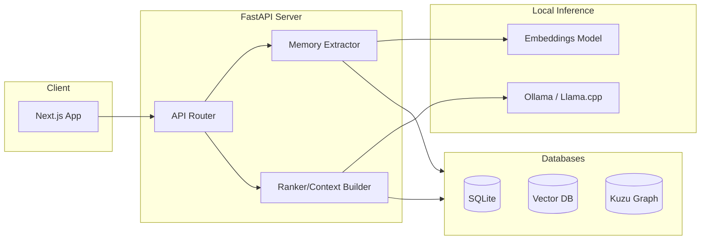

# High-Level Design (HLD)

## 1. Request Flow Lifecycle

### Phase 1: Ingestion & Extraction
1. User sends message: `"I've decided to use PyTorch for my recommendation system."`
2. Backend receives message and routes it to the **Memory Engine**.
3. Memory Engine analyzes the text:
   - Extracts structured memory: `type: decision`, `subject: recommendation system`, `value: PyTorch`.
   - Extracts Entities/Relations: `User -> building -> Recommendation System -> uses -> PyTorch`.

### Phase 2: Processing & Storage
1. **Duplicate Detection**: Queries Vector DB for similar facts. If similar, updates/merges.
2. **Conflict Detection**: Checks if this contradicts existing facts (e.g., old memory said "TensorFlow"). Marks old as superseded.
3. **Importance Scoring**: Calculates score (e.g., 0.92) based on user-specificity and goal relevance.
4. **Persistence**: Saves embedding to Vector DB and nodes/edges to Kuzu.

### Phase 3: Retrieval & Augmentation
1. Message is embedded and searched against Vector DB (Semantic Match).
2. Entities in message trigger graph traversal in Kuzu (Logical Match).
3. Results are merged and ranked based on:
   `Score = Similarity + Importance + Recency + Rel_Strength + Confidence`
4. Top N memories are formatted into a system prompt.

### Phase 4: Generation
1. LLM receives: System Prompt (with User Profile/Memories) + Conversation History + New Message.
2. LLM generates personalized response.
3. (Optional Post-Process): Asynchronous extraction of any new decisions made during the AI's response.

## 2. Deployment Architecture (Local Mode)

