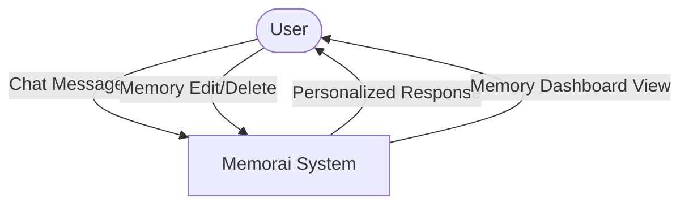
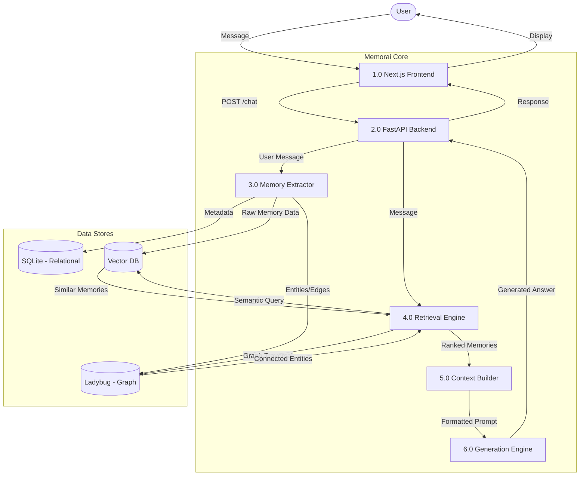
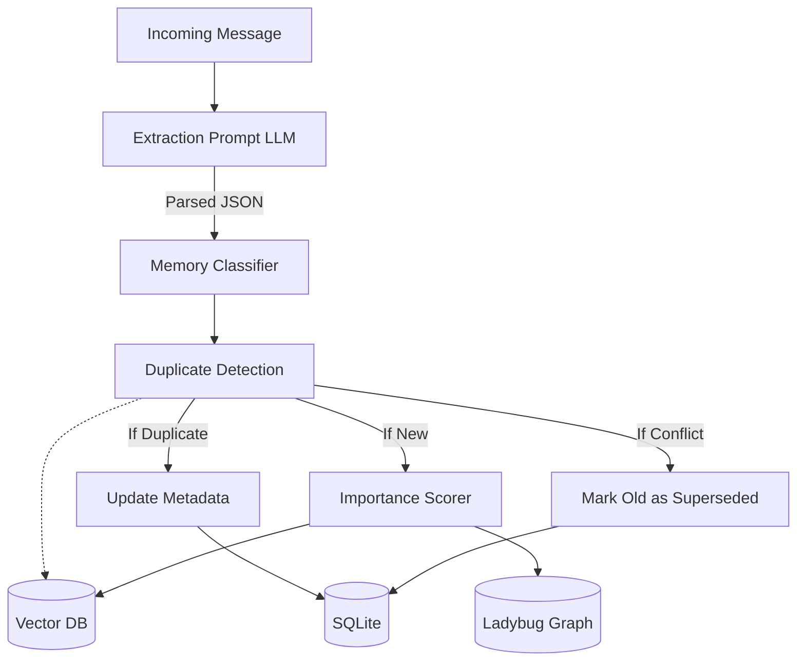

# Data Flow Diagram (DFD)

## Context Diagram (Level 0)

```mermaid
graph TD
    User([User]) -- Chat Message --> System[Memorai System]
    System -- Personalized Response --> User
    
    User -- Memory Edit/Delete --> System
    System -- Memory Dashboard View --> User
```

## Level 1 DFD: Core Architecture

```mermaid
graph TD
    User([User])
    
    subgraph Memorai Core
        UI[1.0 Next.js Frontend]
        API[2.0 FastAPI Backend]
        Extractor[3.0 Memory Extractor]
        Retriever[4.0 Retrieval Engine]
        Context[5.0 Context Builder]
        LLM[6.0 Generation Engine]
    end
    
    subgraph Data Stores
        SQL[(SQLite - Relational)]
        VDB[(Vector DB)]
        Graph[(Ladybug - Graph)]
    end
    
    User -- Message --> UI
    UI -- POST /chat --> API
    
    API -- User Message --> Extractor
    Extractor -- Raw Memory Data --> VDB
    Extractor -- Entities/Edges --> Graph
    Extractor -- Metadata --> SQL
    
    API -- Message --> Retriever
    Retriever -- Semantic Query --> VDB
    Retriever -- Graph Traversal --> Graph
    
    VDB -- Similar Memories --> Retriever
    Graph -- Connected Entities --> Retriever
    
    Retriever -- Ranked Memories --> Context
    Context -- Formatted Prompt --> LLM
    LLM -- Generated Answer --> API
    
    API -- Response --> UI
    UI -- Display --> User
```

## Level 2 DFD: Memory Extraction

```mermaid
graph TD
    API[Incoming Message] --> ExtractLLM[Extraction Prompt LLM]
    ExtractLLM -->|Parsed JSON| Classifier[Memory Classifier]
    
    Classifier --> DupeCheck[Duplicate Detection]
    DupeCheck -.-> VDB[(Vector DB)]
    
    DupeCheck -- If Duplicate --> UpdateMemory[Update Metadata]
    DupeCheck -- If Conflict --> MarkSuperseded[Mark Old as Superseded]
    DupeCheck -- If New --> Scorer[Importance Scorer]
    
    UpdateMemory --> SQL[(SQLite)]
    MarkSuperseded --> SQL
    Scorer --> VDB
    Scorer --> Graph[(Ladybug Graph)]
```
