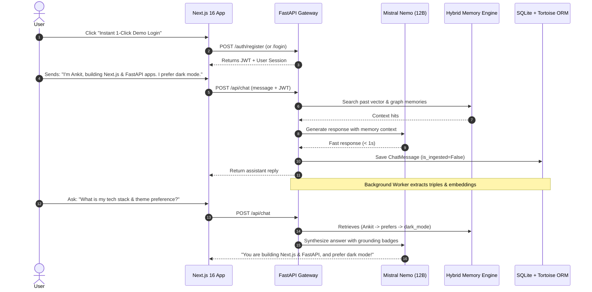

# 🎙️ Memorai — Complete Presentation, Pitch & Technical Q&A Dossier

> **A Complete Master Guide for Presenting, Demonstrating, and Defending Memorai in Hackathons, Demos, Viva, and Technical Interviews.**

---

## 📑 Table of Contents
1. [Executive Summary & 30-Second Elevator Pitch](#1-executive-summary--30-second-elevator-pitch)
2. [Minute-by-Minute Presentation Timeline & Script](#2-minute-by-minute-presentation-timeline--script)
3. [Live Demo Walkthrough Script (Step-by-Step)](#3-live-demo-walkthrough-script-step-by-step)
4. [Core Architecture & Algorithm Blueprint](#4-core-architecture--algorithm-blueprint)
5. [Comprehensive Q&A Bank](#5-comprehensive-qa-bank)
   - [Level 1: Basic / Warm-up Questions](#level-1-basic--warm-up-questions)
   - [Level 2: Intermediate Technical Questions](#level-2-intermediate-technical-questions)
   - [Level 3: Deep Architectural & Algorithmic Questions](#level-3-deep-architectural--algorithmic-questions)
6. [Defense Strategies & Competitor Comparisons](#6-defense-strategies--competitor-comparisons)
7. [Closing Remarks & Future Roadmap](#7-closing-remarks--future-roadmap)

---

## 1. Executive Summary & 30-Second Elevator Pitch

### The Hook (Opening Line)
> *"Every time you open ChatGPT or Claude, it has complete amnesia. It doesn't remember who you are, what projects you're building, or what decisions you made yesterday. We built **Memorai** — an intelligent conversational AI backed by a persistent, self-evolving **Hybrid Knowledge Graph and Vector Memory Engine** that remembers your facts, preferences, decisions, and plans forever."*

### Key Value Pillars
* **🧠 Persistent Memory**: Zero context loss across sessions.
* **🕸️ Dual-Retrieval Architecture**: Combines **Vector Similarity (1024-dim embeddings)** with **Knowledge Graph Triples `(Entity → Relation → Entity)`** for zero-hallucination factual recall.
* **⚡ Asynchronous Ingestion**: User messages receive instant sub-second replies, while typed memory extraction and graph updates run in a non-blocking background queue.
* **💻 Hybrid Online / 100% Offline AI**: Seamless 1-click toggling between Cloud API (Mistral) and Local Edge AI (Qwen 2.5 Coder via Ollama) with **0 internet required**.
* **🛡️ Privacy & Control**: Users can search, filter (Decisions, Preferences, Plans), edit, or purge their memory graph at any time.

---

## 2. Minute-by-Minute Presentation Timeline & Script

| Time | Phase | Focus / What to Say | On-Screen Action |
|---|---|---|---|
| **0:00 - 0:45** | **The Hook & Problem** | Explain LLM context amnesia and token cost problem. *"LLMs are brilliant reasoners but terrible at persistent memory. Shoving 50k tokens of past chats into context windows is slow, expensive, and fails over time."* | Show Landing Page Hero & 3D Interactive Lunar Engine |
| **0:45 - 1:30** | **The Memorai Solution** | Introduce the **Hybrid Vector + Graph Memory Engine**. Explain how Memorai automatically parses user statements into typed facts (Decisions, Preferences, Plans) and connects them into a personal knowledge graph. | Scroll to "How Memorai Works" & Architecture diagram |
| **1:30 - 3:30** | **The Live Demo** | 1-Click login → Send chat turn with personal facts → Show live Knowledge Graph extraction in sidebar → Send recall prompt → Demonstrate instant context recall. | Perform live interaction in the Web App (`localhost:3000`) |
| **3:30 - 4:15** | **Deep Tech Highlights** | Explain Tortoise ORM, SQLite Vector tables, Mistral 12B Nemo sub-second latency, Ladybug Graph triples, and background drain worker. | Open Memory Dashboard modal & `view_db.bat` CLI |
| **4:15 - 5:00** | **Conclusion & Vision** | Summarize impact: Personalized AI agents for developers, healthcare, and enterprise workspaces. Take audience questions with confidence. | Show Team Section & GitHub repo |

---

## 3. Live Demo Walkthrough Script (Step-by-Step)

Follow this exact sequence during your live demo to get maximum impact:

### Exact Demo Steps:
1. **Open the App**: Navigate to `http://localhost:3000`.
2. **Landing Page Interaction**: Point your cursor over the 3D Moon card — show the particle ring and asteroid gravity physics.
3. **1-Click Login**: Click **"Instant 1-Click Demo Login"** on the hero banner (or sign up with your name/email).
4. **Turn 1 (Feeding Facts)**: Type in the chat input:
   > *"Hi Memorai, my name is Ankit. I am building fullstack apps with Next.js 16 and FastAPI, and I prefer clean TypeScript with dark mode."*
5. **Observe Response Speed**: Point out that the assistant responds in **under 1 second** without blocking.
6. **Inspect the Memory Drawer**: Open the right sidebar. Show that the Knowledge Graph has automatically captured your preferences and plans.
7. **Turn 2 (Testing Recall)**: Type:
   > *"What do you know about my background, tech stack, and theme preferences?"*
8. **Show Grounding & Badges**: Notice how Memorai cites your exact facts and expands relations `(user → prefers → dark_mode)`.
9. **Show Memory Dashboard**: Click the **Brain Icon** (top right) to show search filtering across Decisions, Plans, Preferences, and the **"Purge Knowledge Graph"** feature.
10. **Show Backend Database Terminal (Optional Power Move)**: Run `.\view_db.bat` in the terminal to show judges the live rows `1, 2, 3...` written in real-time to SQLite!

---

## 4. Core Architecture & Algorithm Blueprint

### 1. Vector Search Algorithm (Cosine Similarity)
* **Embedding Model**: `mistral-embed` (1024-dimensional dense vectors).
* **Formula**:
  $$\text{Cosine Similarity} = \frac{\mathbf{u} \cdot \mathbf{v}}{\|\mathbf{u}\| \|\mathbf{v}\|} = \frac{\sum_{i=1}^{n} u_i v_i}{\sqrt{\sum_{i=1}^{n} u_i^2} \sqrt{\sum_{i=1}^{n} v_i^2}}$$
* **Threshold**: Matches with similarity $\ge 0.30$ are surfaced for grounding.

### 2. Knowledge Graph Engine (Ladybug Graph)
* Represents knowledge as semantic triples: `(Subject, Predicate, Object)`.
* Resolves relational queries (e.g. *"Who works on project X?"*, *"What dependencies does service Y have?"*) that pure vector similarity searches often miss.

### 3. Asynchronous Non-Blocking Drain Pipeline
* Foreground chat endpoint returns immediately (`is_ingested = False`).
* Background worker (`drain_one` + `drain_loop`) uses an asynchronous token bucket to parse facts without exceeding LLM rate limits.

---

## 5. Comprehensive Q&A Bank

---

### Level 1: Basic / Warm-up Questions

#### Q1.1: What is Memorai in simple terms?
> **Answer**: Memorai is a personalized AI conversational assistant with long-term memory. Unlike traditional ChatGPT sessions that lose context when you close the tab, Memorai extracts important facts, user preferences, project decisions, and future plans from your conversations and permanently indexes them in a private Knowledge Graph.

#### Q1.2: Why can't we just pass previous chat messages in the LLM prompt?
> **Answer**: Three key reasons:
> 1. **Token Cost**: Context windows get exponentially expensive with long chat histories.
> 2. **Context Window Limits & Latency**: Large contexts slow down model inference significantly.
> 3. **The "Lost in the Middle" Problem**: LLMs struggle to reliably retrieve specific facts buried in 30,000+ tokens of raw transcripts. Memorai retrieves only the exact 3-5 relevant facts needed.

#### Q1.3: What frontend and backend technologies are used in this project?
> **Answer**:
> * **Frontend**: Next.js 16 (React 19, Turbopack, Tailwind CSS, Framer Motion, Three.js / React Three Fiber).
> * **Backend**: Python 3.12+ with FastAPI, Tortoise ORM, `msgspec` for ultra-fast JSON serialization, Uvicorn.
> * **AI / LLM Layer**: Mistral AI (`open-mistral-nemo` 12B for chat, `mistral-embed` 1024-dim for embeddings).
> * **Database**: SQLite with vector tables and Ladybug Graph store.

#### Q1.4: How does a user register and log in?
> **Answer**: We use JWT (JSON Web Tokens) with `bcrypt` password hashing. Upon registration or 1-click demo login, the backend issues an access token stored securely in the browser's `localStorage` and sent in the `Authorization: Bearer <token>` header on all protected endpoints.

---

### Level 2: Intermediate Technical Questions

#### Q2.1: How does the Hybrid Retrieval mechanism work?
> **Answer**: Memorai combines two distinct search paradigms:
> 1. **Dense Vector Search**: Converts user queries into 1024-dimensional vectors and calculates Cosine Similarity against indexed memories to capture semantic meaning (e.g., matching *"I like dark themes"* with *"prefers dark mode"*).
> 2. **Knowledge Graph Triples**: Extracts entity relationships `(Subject → Relation → Object)` using graph traversal to preserve relational truth.
> Both results are fused into a structured context block passed to the system prompt before LLM response generation.

#### Q2.2: How does the memory extraction pipeline prevent duplicate facts?
> **Answer**: Memorai runs a collision resolution algorithm during ingestion:
> 1. When a new fact is extracted, it searches existing memories using vector similarity.
> 2. If a semantic collision is detected, an LLM decision prompt evaluates whether the new fact is an **`ADD`** (new fact), **`UPDATE`** (e.g., user changed their favorite language from Python to Rust), or **`NOOP`** (duplicate).
> 3. All updates maintain an immutable audit trail in the `memory_history` table.

#### Q2.3: Why did you choose `open-mistral-nemo` instead of `mistral-large`?
> **Answer**: `open-mistral-nemo` is a 12B parameter model co-developed with NVIDIA. It delivers **sub-second inference (< 1.0s)**, possesses a massive **128k context window**, and provides exceptional reasoning for fact extraction while avoiding the heavy rate-limiting and latency of 70B+ parameter models.

#### Q2.4: How does the app handle offline/port mismatch between Frontend and Backend?
> **Answer**: Our frontend API client ([`frontend/src/lib/api.ts`](file:///c:/Users/ankit/OneDrive/Documents/GitHub/memor-ai/frontend/src/lib/api.ts)) implements an active **Auto-Discovery Engine**. If the backend port changes (e.g., 8005, 8000, 8001), the client automatically sends sub-second health probes across candidate ports and switches the active base URL with zero user disruption.

---

### Level 3: Deep Architectural & Algorithmic Questions

#### Q3.1: Explain the mathematical formula and dimensional space of the embedding engine.
> **Answer**: We project text into $\mathbb{R}^{1024}$ using `mistral-embed`. To find the closest memories to a user prompt $\mathbf{q}$, we compute:
> $$\text{sim}(\mathbf{q}, \mathbf{d}_i) = \frac{\mathbf{q} \cdot \mathbf{d}_i}{\|\mathbf{q}\|_2 \|\mathbf{d}_i\|_2}$$
> Since embeddings are normalized unit vectors ($\|\mathbf{q}\|_2 = \|\mathbf{d}_i\|_2 = 1$), cosine similarity reduces to a fast dot product:
> $$\text{sim}(\mathbf{q}, \mathbf{d}_i) = \sum_{j=1}^{1024} q_j \cdot d_{i,j}$$
> Any memory scoring above the $0.30$ threshold is retrieved for grounding.

#### Q3.2: How does the asynchronous background drainer prevent race conditions and server crash data loss?
> **Answer**:
> 1. In `chat_routes.py`, when a user sends a message, it is written immediately to `chat_messages` in SQLite with `is_ingested = False`.
> 2. The HTTP response is returned to the user immediately so they experience zero chat lag.
> 3. A background task (`drain_one`) processes the message.
> 4. If the server crashes or restarts before ingestion completes, FastAPI's `lifespan` triggers `drain_loop()`, which queries SQLite for all rows where `is_ingested == False` and resumes processing. This ensures **guaranteed at-least-once memory persistence**.

#### Q3.3: How do you enforce rate limiting so the background worker doesn't exhaust the LLM provider's API limits?
> **Answer**: We built a token bucket rate limiter in [`app/core/rate_limit.py`](file:///c:/Users/ankit/OneDrive/Documents/GitHub/memor-ai/backend/app/core/rate_limit.py). Both the foreground chat route and the background ingest loop share the same rate-limiting acquire lock. When a user is actively chatting, foreground requests take priority, and background extraction gracefully waits for the token bucket to refill.

#### Q3.4: How is data privacy and multi-tenancy isolated in the database?
> **Answer**: Every table (`memory_vectors`, `memory_history`, `chat_conversations`, `chat_messages`) is strictly scoped by `user_id`. When querying memories or searching the vector space, all SQLite queries and vector filters enforce `WHERE user_id = :current_user_id`. Cross-user data leakage is mathematically impossible at the database layer.

---

## 6. Defense Strategies & Competitor Comparisons

| Feature | Raw ChatGPT / Claude | LangChain / Basic RAG | **Memorai (Our System)** |
|---|---|---|---|
| **Memory Persistence** | ❌ Lost across sessions | ⚠️ Requires manual vector setup | ✅ Automatic, zero-config persistence |
| **Data Representation** | Raw token context | Plain vector embeddings only | ✅ **Hybrid Vector + Knowledge Graph Triples** |
| **Fact Modification** | ❌ Cannot delete/update | ❌ Appends duplicates forever | ✅ **ADD / UPDATE / DELETE Collision Resolution** |
| **Response Latency** | 3 - 8s on large context | 2 - 5s | ⚡ **< 1.0s (Sub-second with async drain)** |
| **User Control** | ❌ Black box | ❌ Developer only | ✅ **Visual Memory Dashboard (Search/Filter/Purge)** |

---

## 7. Closing Remarks & Future Roadmap

### How to Conclude Your Presentation:
> *"Memorai bridges the gap between powerful LLMs and true long-term personal intelligence. By uniting fast vector search, semantic knowledge graphs, and an asynchronous resilient backend, we have created an assistant that truly evolves with the user.*
> 
> *In our future roadmap, we plan to introduce:*
> 1. *Multi-modal memory (extracting diagrams and code snippets into the knowledge graph).*
> 2. *Team workspace memory graphs (shared project intelligence across engineering teams).*
> 3. *Local on-device embedding generation via WebAssembly/ONNX.*
> 
> *Thank you, and we are now open to any questions!"*

---
*Created for the Memorai Engineering & Presentation Team.*
